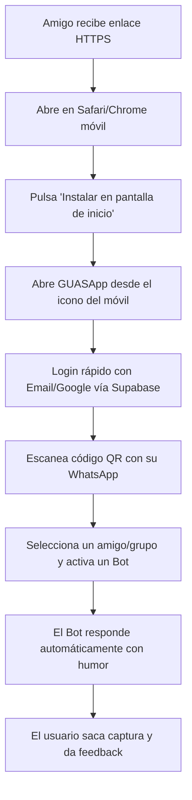

# PRD: Fase Beta Móvil con Amigos (PWA & Despliegue) 📱👥

*Versión 1.0 - Hito de Validación con Usuarios Reales*

---

## 1. Objetivo y Visión del Hito
El objetivo de este paso es **poner GUASApp en manos de un grupo controlado de amigos y testers (5-15 personas)** para que lo usen directamente desde sus teléfonos móviles (iOS y Android) como una aplicación instalada (PWA), sin pasar por tiendas de aplicaciones y con coste de infraestructura cero.

### Criterios de Éxito de la Beta:
1. **Instalación sin fricción:** Los testers pueden abrir un enlace web, pulsar "Añadir a pantalla de inicio" y tener el icono de GUASApp listo en menos de 2 minutos.
2. **Vinculación exitosa:** El 100% de los testers pueden escanear el QR desde su WhatsApp oficial y ver sus chats reflejados en el panel.
3. **Estabilidad del Troleo:** Ejecutar al menos 10 conversaciones reales de broma sin caídas del bot ni repeticiones absurdas de respuestas.
4. **Recogida de Feedback:** Identificar qué personalidades son las más divertidas y qué fallos de usabilidad móvil aparecen.

---

## 2. Requisitos Funcionales (Lo que debe tener la Beta)

### 2.1. Despliegue y Acceso Público (Cloud)
- **Frontend Público:** Alojado en **Vercel** o **Netlify** con certificado SSL (HTTPS imprescindible para que la PWA funcione).
- **Backend Centralizado:** Contenedor Docker desplegado en un servicio en la nube con soporte WebSockets (ej. **Railway**, **Render** o un VPS económico).
- **Aislamiento Multi-Sesión:** Cada amigo se registra con su cuenta de Supabase. El backend asocia la sesión de WhatsApp (`.wwebjs_auth/session-<userId>`) al usuario correspondiente para que nadie vea los chats de otros.

### 2.2. Experiencia Móvil Touch (Mobile-First UI)
- **Bloqueo de Zoom y Rebotes:** Configuración de `viewport` para que la app se sienta nativa, sin gestos accidentales de zoom al tocar botones.
- **Navegación Táctil:**
  - Barra de navegación inferior fija (Tabs: *Chats*, *Monitor en Vivo*, *Personalidades*, *Ajustes*).
  - Listas de contactos con scroll suave y botones de encendido/apagado tipo *switch* accesibles con el pulgar.
- **Botón de Pánico Ergonómico:** Botón flotante accesible desde cualquier pantalla del móvil para cortar la broma al instante.

### 2.3. Configuración de Inteligencia Artificial en la Beta
- **API Key por Defecto (Gemini Gratuito):** El backend proporcionará una clave de Gemini para que los amigos no tengan que registrarse en Google Cloud para probarlo.
- **Opción de Clave Propia:** Los testers avanzados podrán introducir su propia API Key desde el modal de ajustes si se supera la cuota gratuita general.
- **Filtro de Seguridad / Safe Prank:** Instrucción de sistema para evitar insultos graves, amenazas o situaciones que violen las políticas de WhatsApp.

### 2.4. Herramienta de Feedback Integrada
- **Botón "¿Qué tal la broma?":** Un botón flotante discreto o enlace rápido en el menú que abre un formulario simple (o chat directo) para reportar:
  - *¿Se ha repetido el bot?*
  - *¿Ha fallado alguna respuesta?*
  - *Propuestas de nuevas personalidades.*

---

## 3. Flujo de Usuario para los Amigos (Beta User Journey)

---

## 4. Requisitos Técnicos y No Funcionales

| Requisito | Especificación |
| :--- | :--- |
| **Plataformas Soportadas** | iOS (Safari 15+) y Android (Chrome 100+). |
| **Tiempo de Respuesta** | La IA debe responder en WhatsApp en un rango de 2 a 5 segundos (simulando escritura humana). |
| **Coste de Infraestructura** | **0 € / mes** durante la fase beta (usando capas gratuitas de Vercel, Supabase y Gemini). |
| **Privacidad** | Los mensajes de WhatsApp no se guardan permanentemente en texto plano en la nube; solo se procesan en memoria para la respuesta. |

---

## 5. Plan de Acción Inmediato para este Paso

1. **Ajuste de CSS Móvil:** Revisar que el Dashboard y el Monitor de chat no tengan desbordamientos horizontales en pantallas de 375px a 430px (iPhone y Android estándar).
2. **Subida del Frontend a Vercel:** Conectar el repositorio de GitHub con Vercel para obtener la URL pública con SSL.
3. **Subida del Backend Dockerizado a Railway:** Desplegar el `Dockerfile` que acabamos de crear y configurar las variables de entorno (`SUPABASE_URL`, `GEMINI_API_KEY`).
4. **Prueba de Humo Inicial:** Tú misma instalas la PWA en tu móvil y haces la primera prueba de troleo.
5. **Envío a Amigos:** Enviar enlace a 3-5 amigos de confianza con las instrucciones de instalación.
